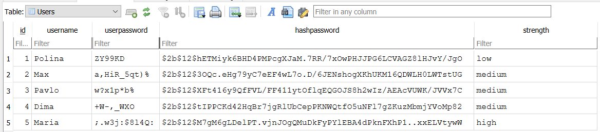

# Simple Password Generator

### Overview
This project is a password generator that allows users to create secure passwords based on selected criteria and store them in an SQLite database. Users can choose specific password requirements, including uppercase and lowercase letters, digits, and special characters. Additionally, the program provides a password strength evaluation and securely hashes the generated password using bcrypt.

### Features
- **Customizable Password Generation**: Users can specify:
  - Password length
  - Whether uppercase letters, lowercase letters, digits, and/or special characters are needed
- **Password Strength Evaluation**:
  - Based on length and character variety, the program rates the password as "high", "medium", or "low" in reliability.
- **Password Hashing**:
  - Uses bcrypt to hash passwords for secure storage.
- **Database Storage**:
  - Stores the username, plain password, hashed password, and password strength in an SQLite database.

### Project Structure
- `main.py`: Main script that generates the password, evaluates strength, hashes the password, and stores it in the database.
- `controllers.py`: Contains functions for database operations, including `insert_password`, which adds user data to the database.
- `db/password.db`: SQLite database file that stores user details and password information.

### How It Works
1. The program prompts the user to enter a username and desired password length.
2. Users can specify if they want uppercase letters, lowercase letters, digits, or special characters in the password.
3. Based on the chosen options, a password is generated and displayed.
4. The program evaluates the password strength and hashes it with bcrypt.
5. The hashed password and other details are stored in an SQLite database (`password.db`).

### Table Structure
The `Users` table in `password.db` contains:
- `id`: Primary key for each entry
- `username`: Name associated with the password
- `userpassword`: Plain text password
- `hashpassword`: Bcrypt-hashed password
- `strength`: Strength rating of the password

### Database
For managing the database, [DB Browser for SQLite](https://sqlitebrowser.org/) is used. It provides an intuitive graphical interface for working with SQLite databases.

### Example: Filled Database

Here is an example of what the database looks like after being populated with data:



This image shows the SQLite database after data has been inserted. The database is stored in the `passwords.db` file and contains a table where passwords are stored.

### Requirements
- **Python 3.x**
- **bcrypt** library: `pip install bcrypt`

### How to Run
1. Clone this repository.
2. Install the necessary dependencies:
   ```bash
   pip install bcrypt

